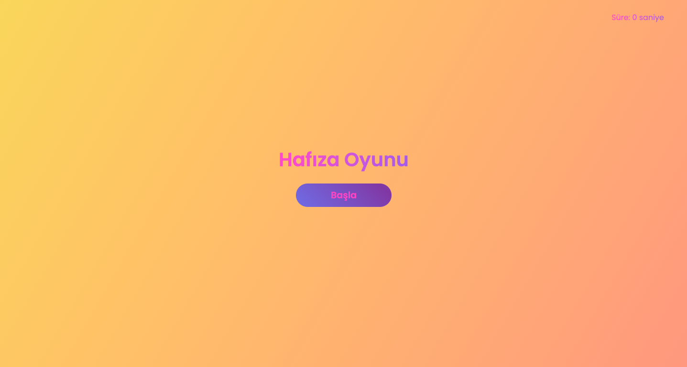
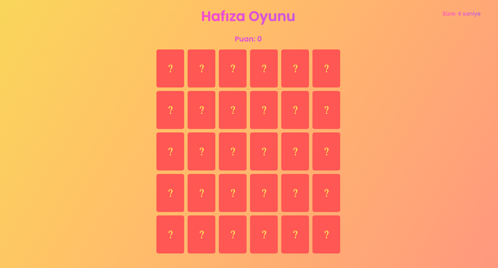

## 🧠 Hafıza Kartı Oyunu
Bu proje, JavaScript kütüphaneleri ve araçlarının logolarını içeren eğlenceli bir hafıza kartı oyunudur. React ve Redux kullanılarak geliştirilmiştir.

---

## 🧩 Oyun Özellikleri
- Her kart bir JavaScript teknolojisi logosudur.

- Oyuncu aynı logoya sahip iki kartı eşleştirmeye çalışır.

- Zamanlayıcı oyun başladığında çalışır, oyun bittiğinde durur.

- Oyun bittiğinde süre gösterilir.

- Responsive tasarım: mobil cihazlarda da oynanabilir.

- Başlangıçta "Başla" butonu, oyun tamamlandığında "Tekrar Başla" butonu görünür.

- Renkli geçişli başlık ve animasyonlu kart geçişleri.

---

## 🛠️ Kullanılan Teknolojiler
- React

- Redux Toolkit

- CSS Animasyonları

- JavaScript

---

## 📁 Proje Yapısı

```
src/
├── components/
│   ├── Card.jsx
│   ├── GameBoard.jsx
│   ├── GameControls.jsx
│   ├── Timer.jsx
├── redux/
│   ├── gameSlice.js
│   └── store.js
├── App.css
├── App.jsx
├── index.css
└── main.jsx
````

---

## ⚙️ Kullanım Talimatları

1. Projeyi indirin veya klonlayın:

```
git clone https://github.com/devburcu/card-game.git
```

2. Proje klasörüne girin:
```
cd card-game
```

3. Gerekli paketleri yükleyin:
```
npm install
```

4. Geliştirme sunucusunu başlatın:
```
npm run dev
```

---

## ## 💻 Masaüstü Görünümü


